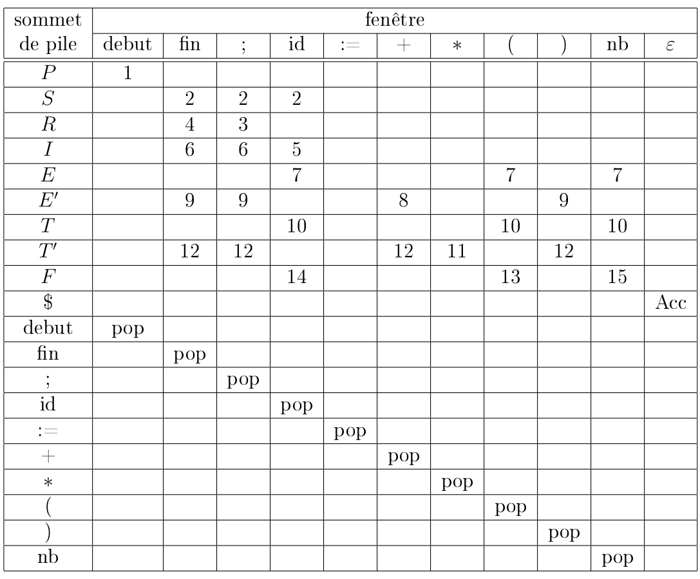
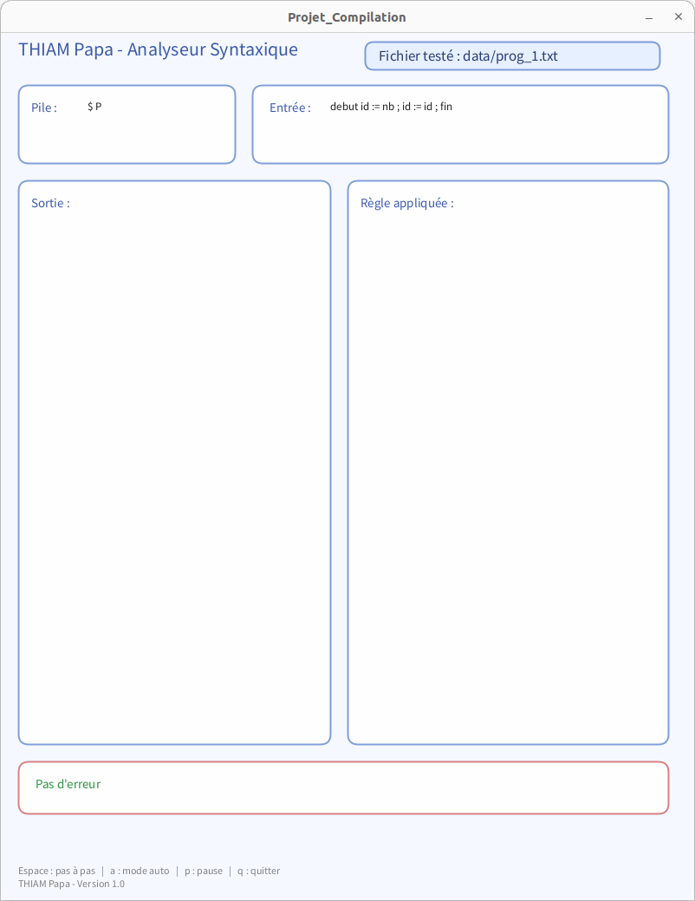

# Projet Compilation 2025 - M1 IWOCS

Ce projet consiste à développer une application en Processing permettant de visualiser le processus d'analyse d'un programme source selon une grammaire donnée. L'application devra inclure les fonctionnalités suivantes :

- Lecture d'un programme source, conforme ou non à la grammaire spécifiée, à partir d'un fichier texte en entrée.
- Visualisation de l'évolution de la pile au cours de l'analyse.
- Affichage de l'évolution de la sortie générée.

Cette animation vise à illustrer le fonctionnement du transducteur lors de l'analyse syntaxique.


## Grammaire
```
(1)  P → debut S fin
(2)  S → IR
(3)  R → ;IR
(4)  R → ε
(5)  I → id := E
(6)  I → ε
(7)  E → T E′
(8)  E′ → +T E′
(9)  E′ → ε
(10) T → F T′
(11) T′ → ∗F T′
(12) T′ → ε
(13) F → (E)
(14) F → id
(15) F → nb
```
## La Table 

## Programme à analyser 
```
// essai de compilation
debut
a:=3;
b:=a; // b vaut 3
fin
```
> D'autres programmes peuvent être testés, mais ils doivent respecter la grammaire ci-dessus.

## Interface 


## Fonctionnalités
- [ ] Lire un fichier texte contenant le programme source.
- [ ] Vérifier la conformité du programme source à la grammaire spécifiée.
- [ ] Visualiser l'évolution de la pile au cours de l'analyse.
- [ ] Afficher l'évolution de la sortie générée.
- [ ] Gérer les erreurs de syntaxe et afficher des messages d'erreur appropriés.

## Technologies utilisées
- [Processing](https://processing.org/) : un environnement de développement intégré (IDE) et un langage de programmation basé sur Java, conçu pour la création d'animations et d'interactions visuelles.
- [Java](https://www.java.com/) : un langage de programmation orienté objet utilisé pour développer l'application Processing.

## Commandes de l'application
- `a` : pour lancer l'animation
- `Espace` : pour défiler l'animation
- `q` : pour quitter l'application

## Auteur
- Nom : THIAM
- Prénom : Papa
- Email : papa-abdoulaye.thiam@etu.
- Université : Université de Havre

## statut du projet
> Le projet est terminé et fonctionnel. Néanmoins, il peut être amélioré en ajoutant des fonctionnalités ou améliorant l'interface utilisateur.

